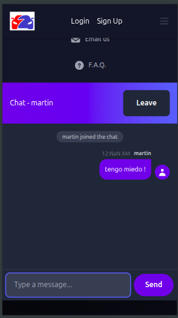
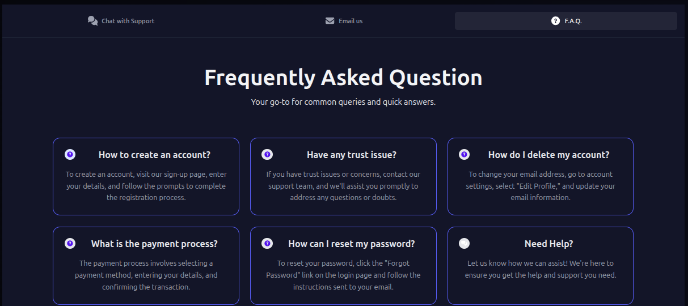
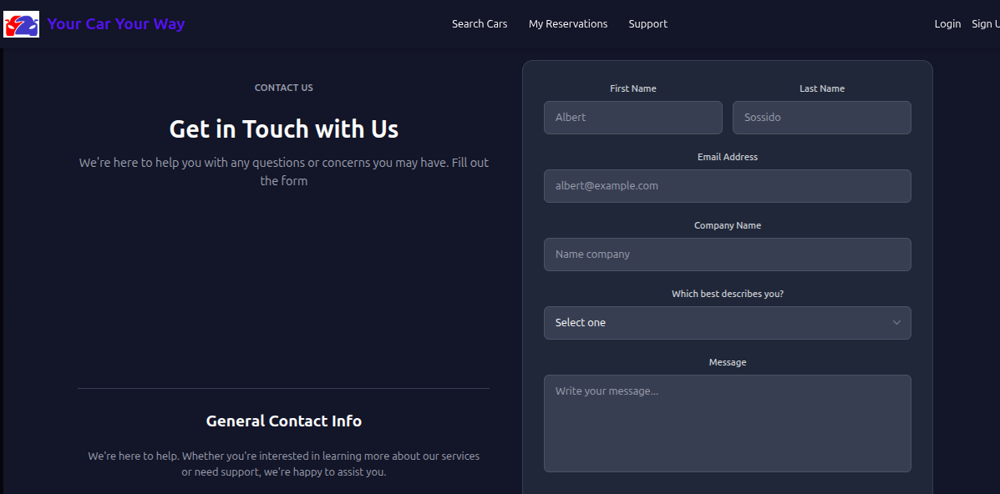

# Your Car Your Way - Live Chat Proof of Concept


## 📋 Overview

This is a Proof of Concept (PoC) for the live chat functionality of the Your Car Your Way car rental application. This PoC demonstrates the technical feasibility of real-time communication between customers and support agents using WebSocket technology.

## Purpose

This PoC validates the core architecture decisions for the Support Service microservice, specifically:

- Real-time bidirectional communication via WebSockets
- Utilization of STOMP protocol for message routing
- Integration with Spring Boot and Spring Security for authentication and authorization
- Message persistence and chat session management
- Integration between Angular frontend and Spring Boot backend
- Database design for chat storage

**Note:** This is a simplified implementation focused on proving the concept. It is not a production-ready application.

## 🏗️ Architecture Alignment

This PoC implements a subset of the Support Service from the Your Car Your Way architecture:

```text
┌─────────────────────────────────────────┐
│          Angular Frontend               │
│   (Live Chat User Interface)            │
└────────────────┬────────────────────────┘
                 │ WebSocket (STOMP)
                 ↓
┌─────────────────────────────────────────┐
│      Spring Boot Backend                │
│   (WebSocket Server + Message Handler)  │
└────────────────┬────────────────────────┘
                 │
                 ↓
┌─────────────────────────────────────────┐
│         PostgreSQL Database             │
│  (chat_sessions + chat_messages tables) │
└─────────────────────────────────────────┘
```

## 🚀 Technologies Used

### Backend

- Spring Boot 3.5.7 - Java framework for backend services
- Spring WebSocket - Real-time WebSocket communication
- Spring Web - REST API endpoints
- Lombok - Reduce boilerplate code
- Java 21 - Programming language
- WebSocket (STOMP)
- Maven - Dependency management

### Frontend

- Angular 19+ - Frontend framework
- TypeScript - Programming language
- STOMP over WebSocket - Messaging protocol
- RxJS - Reactive programming library
- Tailwind CSS - Utility-first CSS framework
- Vite - Build tool

## Database

- PostgreSQL 14+ - Relational database
- See `database/setup.sql` for schema definition

## 📁 Project Structure

```text
YOURCARWAYAPP/
├── backend/                    # Spring Boot application
│   ├── .mvn/                   # Maven wrapper
│   ├── src/
│   │   └── main/
│   │       └── java/           # Java source code
│   ├── mvnw                    # Maven wrapper script
│   ├── mvnw.cmd               # Maven wrapper (Windows)
│   ├── pom.xml                # Maven dependencies
│   └── HELP.md                # Spring Boot help
│
├── front-ang/                  # Angular application
│   ├── src/
│   │   ├── app/               # Angular components
│   │   ├── assets/            # Static assets
│   │   └── styles.scss        # Global styles
│   ├── screenshots/           # Demo screenshots
│   │   ├── chat.png
│   │   ├── chat-mobile.png
│   │   ├── faq.png
│   │   └── message.png
│   ├── angular.json           # Angular configuration
│   ├── package.json           # NPM dependencies
│   ├── tailwind.config.js     # Tailwind CSS config
│   └── tsconfig.json          # TypeScript config
│
├── database/
│   └── setup.sql              # Database schema
│
└── README.md                  # This file
```

## ⚙️ Prerequisites

Before running this project, ensure you have:

- Java 21 installed
- PostgreSQL 14+ installed
- Node.js 18+ installed
- NPM installed
- Angular CLI 16+ installed
- Yarn (or NPM) installed
- Postman (or any other HTTP client) installed
- VS Code (or any other code editor) installed
- Git installed

## 🗄️ Database Schema

This PoC uses two main tables:

- `chat_sessions` - Stores chat session metadata.

```sql
CREATE TABLE chat_sessions (
    session_id UUID PRIMARY KEY,
    user_id UUID NOT NULL,
    agent_id UUID,
    start_time TIMESTAMP,
    end_time TIMESTAMP,
    session_status VARCHAR(20),
    rating INTEGER
);
```

- `chat_messages` - Stores individual chat messages.

```sql
CREATE TABLE chat_messages (
    message_id UUID PRIMARY KEY,
    session_id UUID REFERENCES chat_sessions,
    sender_type VARCHAR(10) CHECK (sender_type IN ('user', 'agent')),
    sender_id UUID NOT NULL,
    message_content TEXT NOT NULL,
    message_type VARCHAR(20),
    attachment_url VARCHAR(500),
    timestamp TIMESTAMP
);
```

## 📸 Screenshots






## 📝 License

This project is released under the [MIT License](https://opensource.org/licenses/MIT)
