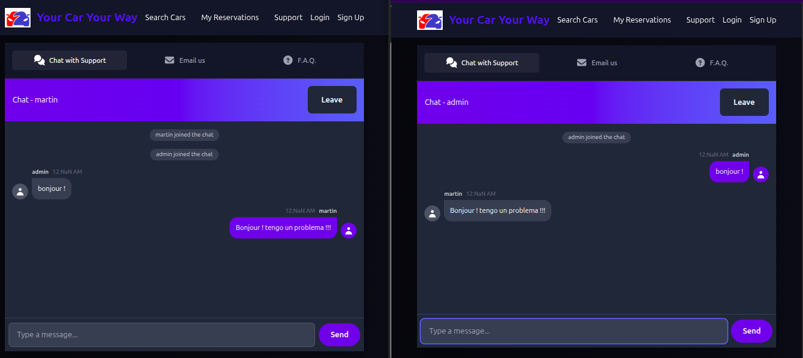

# Your Car Your Way - Live Chat Proof of Concept



## 📋 Overview

This is a Proof of Concept (PoC) for the live chat functionality of the Your Car Your Way car rental application. This PoC demonstrates the technical feasibility of real-time communication between customers and support agents using WebSocket technology.

## Purpose

This PoC validates the core architecture decisions for the Support Service microservice, specifically:

- Real-time bidirectional communication via WebSockets
- Utilization of STOMP protocol for message routing
- Integration with Spring Boot and Spring Security for authentication and authorization
- Message persistence and chat session management
- Integration between Angular frontend and Spring Boot backend
- Database design for chat storage

**Note:** This is a simplified implementation focused on proving the concept. It is not a production-ready application.

## 🏗️ Architecture Alignment

This PoC implements a subset of the Support Service from the Your Car Your Way architecture:

```text
┌─────────────────────────────────────────┐
│          Angular Frontend               │
│   (Live Chat User Interface)            │
└────────────────┬────────────────────────┘
                 │ WebSocket (STOMP)
                 ↓
┌─────────────────────────────────────────┐
│      Spring Boot Backend                │
│   (WebSocket Server + Message Handler)  │
└────────────────┬────────────────────────┘
                 │
                 ↓
┌─────────────────────────────────────────┐
│         PostgreSQL Database             │
│  (chat_sessions + chat_messages tables) │
└─────────────────────────────────────────┘
```
